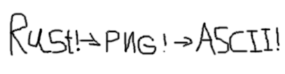

# ASCII

EASY RUSTED ASCII GEN TOOL FROM PNG IMAGES

# INSTALL
INSTALL WELL PRETTY SIMPLE MAKE SURE CARGO INSTALLED
```
$ git clone https://github.com/binarylinuxx/ASCII
$ cd ~/ASCII
$ make build
$ sudo make install
```

# USAGE
```
Convert images to ASCII art

Usage: ascii-gen [OPTIONS] -i <INPUT_IMAGE> -o <OUTPUT_FILE> -m <MODE>

Options:
      --xs <X_RES>             Symbol resolution by X (number, 'auto', or 'auto%N'). Conflicts with --auto-square
      --ys <Y_RES>             Symbol resolution by Y (number, 'auto', or 'auto%N'). Conflicts with --auto-square
  -i <INPUT_IMAGE>             Input image file path
  -o <OUTPUT_FILE>             Output file path
  -m <MODE>                    Rendering mode [possible values: colorful, grayscale, inverted]
  -s, --symbols <SYMBOL_PACK>  Symbol pack to use for ASCII conversion [default: standard] [possible values: standard, detailed, blocks, minimal, digits, binary]
      --show-instantly         Print the ASCII art to console instantly
      --auto-square <SIZE>     Automatic square resolution (number or auto%N). Conflicts with --xs/--ys
  -h, --help                   Print help
  -V, --version                Print version
```

# DEMO


# NOTES
REGULAR --xs --ys DIDNT MANAGED TO HANDLE SQUARE IMAGES BECAUSE IF GOING BE SAME VALUE FOR X,Y SO IM CONSIDERED DO
IT BY EASY WAY INSTEAD OF --xs --ys USE --auto-square FLAG BASICALLY:
```
--auto-square <INTEGER|auto%RATIO> (RATIO IN INTEGER BY PERCENTS)
```
BASICALLY HERE IM IMPLEMENTED MATH OPERATION
X*2
Y STILL SAME 
SO WHEN USE SQUARE IMAGES 1:1 USE --auto-square OF COURSE IF NOT WANT TOWER FROM ASCII SYMBOLS

# TO-DO
* FIX SQUARE IMAGES SQUISHING PROBLEM [X]
* MORE IMAGES FORMATS TESTING [ ]
